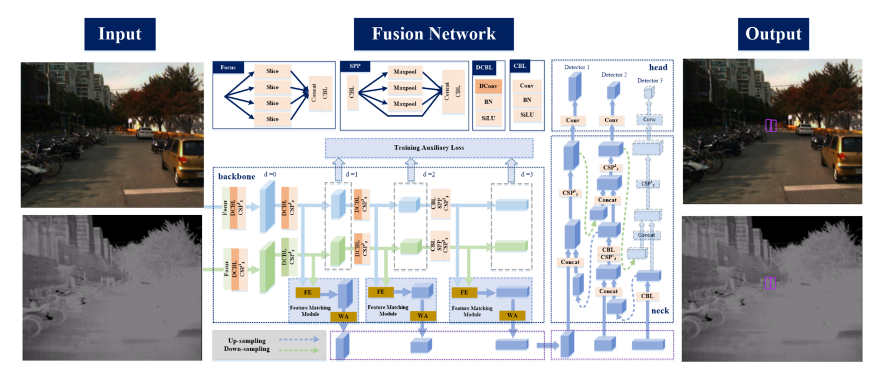
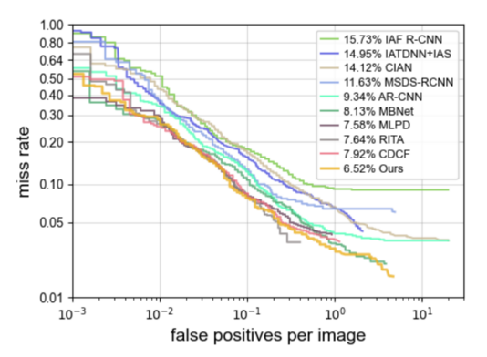

# MIANet: Multi-information Attention Network for Multispectral Pedestrian Detection

This is the repository for the paper **"MIANet: Multi-information Attention Network for Multispectral Pedestrian Detection"**.

## 📖 Introduction

MIANet is a novel multispectral pedestrian detection framework built upon YOLOv5, designed to address the challenges of spatial misalignment and feature discrepancy between visible and thermal images. The network achieves superior detection performance under low-light and adverse weather conditions through the following innovative components:

- 🧠 **Dual-stream Backbone**: Uses deformable convolutions for weak feature alignment
- 🔁 **Feature Matching Module (FMM)**: Achieves cross-modal fusion through differential amplification and spatial attention
- 📈 **Auxiliary Loss**: Enhances modality-specific learning without inference cost

MIANet achieves state-of-the-art performance on KAIST and CVC-14 datasets, especially in nighttime and adverse weather scenarios.

## 🏗️ Network Architecture



## 📊 Experimental Results

### KAIST Dataset

| Method | All | Day | Night |
|--------|-----|-----|-------|
| **MIANet (Ours)** | **6.52** | **6.63** | **5.73** |

### CVC-14 Dataset

| Method | All | Day | Night |
|--------|-----|-----|-------|
| **MIANet (Ours)** | **20.93** | **24.26** | **13.43** |

*Note: Metrics are Log-Average Miss Rate (LAMR), lower is better*

### MR-FPPI Curve Comparison



## 📁 Project Structure

```
├── data/                    # Dataset directory
│   ├── rgb/                # RGB visible images and labels
│   │   ├── images/         # RGB image files
│   │   └── labels/         # Corresponding YOLO format label files
│   └── ir/                 # Infrared images and labels
│       ├── images/         # Infrared image files
│       └── labels/         # Corresponding YOLO format label files
├── figure/                  # Experimental figures
│   ├── network-architecture-diagram.png  # Network architecture diagram
│   └── fppi-mr-benchmark.png            # MR-FPPI curve comparison
└── README.md
```

## 📝 Data Description

### Image Data

- **visible Images**: Located in `data/rgb/images/` directory, containing visible light images
- **thermal Images**: Located in `data/ir/images/` directory, containing corresponding thermal infrared images
- Currently includes sample images: I00050.png ~ I00059.png

### Label Format

Label files are in YOLO format, located in the corresponding `labels/` directory:
- Format: `class_id x_center y_center width height` (normalized coordinates)
- Each image corresponds to a label file with the same name (`.txt` extension)

## 📚 Related Resources

- GitHub Repository: https://github.com/LeeeFu/MIANet-Multi-information-Attention-Network-for-Multispectral-Pedestrian-Detection

**Note**: The code part of this project is still being organized and will be updated gradually.
